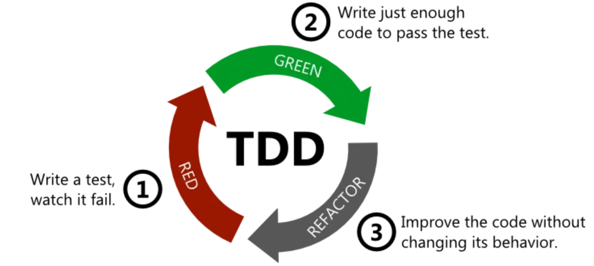

# 리액트 Testing

## Jest

`Jest`는 자바스크립트 테스팅 프레임워크입니다. <https://jestjs.io/>

* 간단한 설정만으로도 테스트를 실행할 수 있습니다.
* 풍부한 matcher를 제공하여 별도의 모듈 없이 테스트를 더 풍부하게 표현할 수 있습니다.
* Coverage도 별도의 설치 없이 확인할 수 있습니다.
* Mocking 등을 지원하여 테스트를 더 쉽게 가능하게 해주는 프레임워크입니다.

```bash
npm i -D jest @types/jest babel-jest
```

## @types/jest

Jest의 타입 정의를 가지고 있는 모듈입니다. TypeScript에서 주로 사용되지만 이 모듈을 설치하게 되면 편집기 내에서 자동완성을 지원하기 떄문에 설치합니다.

## Assertion

단정문이라고 부르는 Assertion은 우리가 기대하는 값이 실제 값이랑 일치하는지 확인하는데 사용합니다. 자바스크립트의 `console.assert`는 우리가 기대하는 값이 아니면 콘솔에 출력되도록하여 프로그래머가 원하는 값이 아닌 경우 즉각적으로 알 수 있도록 도와줍니다. 테스트에도 단정문을 사용하여 우리가 원하는 값이 맞는지 계속해서 피드백을 얻을 수 있습니다.

## Signature

모든 연산은 연산의 이름, 매개변수, 반환값을 명세합니다. 이를 시그니처라고 부릅니다.

## TDD

### 왜 TDD를 해야 하는가

> Ron Jeffries - “clean code that works”
> Kent Beck - “TDD is a way of managing fear during programming.”
> Kent Beck - “TDD is an awareness of the gap between decision and feedback during programming, and techniques to control that gap.”
> GOOSGBT - “Software Development as a Learning Process”
> 모든 테스트를 완전히 자동화 하고 그 결과까지 스스로 검사하게 만들자.
> 테스트를 작성하기 가장 좋은 시점은 프로그래밍을 시작하기 전이다.
> 테스트 주도 개발은 테스트가 개발을 주도하는 방법이다. 테스트가 개발을 주도한다는 것은 테스트가 코딩의 방향을 이끌어 간다는 말이다. 테스트를 실패하는 코드가 없으면 코딩을 하지 않고, 코드상에 중복이 있으면 제거한다는 간단한 규칙을 지켜나가면 자연스레 아름다운 코드가 펼쳐진다. 덤으로 회귀 테스트도 생기고, 개발 과정 자체가 즐거워지는 보너스도 있다.

### 2가지 간단한 룰

1. 먼저 자동화된 테스트에서 실패하지 않는 한 새로운 코드를 작성하지 않는다.
2. 중복을 제거한다.

### How - Red Green Refactoring



TDD에서는 처음에는 통과하지 못할(RED) 테스트를 작성하고, 이 테스트를 통과하게끔(Green) 코드를 작성하고, 결과 코드를 최대한 깔끔하게 리팩터링 하는 짧은 주기로 반복합니다.

1. Red - write a little test that doesn’t work, perhaps doesn’t even compile at first

    ```js
    test('add', () => {
      expect(add(1, 2)).toBe(3);
    });
    ```

    add 함수는 아직 구현된 코드가 없기에 당연히 테스트는 실패합니다. 여기서 주의할 점은 아직 add 함수를 선언하지 않은 점입니다. 테스팅 프레임워크의 **에러 메시지**를 먼저 확인하는 게 가장 중요합니다.

    > ReferenceError: add is not defined

    아마 위와 같은 에러를 먼저 확인할 수 있을 겁니다. 이제 add 함수를 선언할 때입니다. 절대 스텝을 건너 뛰고 앞서가면 안 됩니다.

    ```js
    function add() {
    }

    test('add', () => {
      expect(add(1, 3)).toBe(4);
    });
    ```

    ```bash
    expect(received).toBe(expected) // Object.is equality

    Expected: 4
    Received: undefined
    ```

    당연히 위와 같이 실패할 겁니다. 왜냐하면 add 함수에 내용이 없기 때문이죠. 이제 Green으로 넘어갈 차례입니다.

2. Green - make the test work quickly, committing whatever sins necessary in the process

    수단과 방법을 가리지 않고 가장 빠르게 테스트를 통과시키는 방법은 무엇일까요? 말도 안 된다고 생각하시겠지만 TDD에서는 아래의 코드가 옳습니다.

    ```js
    function add() {
      return 4;
    }

    test('add', () => {
      expect(add(1, 3)).toBe(4);
    });
    ```

3. Refactor - eliminate all the duplication created in just getting the test to work

    이제 중복을 몰아낼 차례입니다. 먼저 의도를 드러내 볼까요?

    ```js
    function add() {
      return 1 + 3;
    }
    ```

    add 함수의 의도가 결과값에서 표현해봤습니다. 하지만 입력값이 바뀔 때마다 return을 계속 수정해줘야 하죠. 이런 중복을 어떻게 몰아낼 수 있을까요? 1, 3은 각각 어디에서 왔나요?

    ```js
    function add(x, y) {
      return x + y;
    }
    ```

    위와 같이 표현하면 중복을 몰아낼 수 있습니다. TDD에서 핵심은 Refactoring 단계입니다. 우리에겐 테스트 코드가 있으니 마음에 들 때까지 얼마든지 코드를 수정해도 문제가 생기지 않습니다. 이 부분에서 Kent Beck이 말한 TDD가 두려움을 조절하는 기술임을 확실하게 느낄 수 있습니다.

    * <https://github.com/ahastudio/til/blob/main/blog/2016/12-03-tdd-faq.md>

## React testing library

리액트 테스팅 라이브러리는 사용자와 동일한 방식으로 DOM 쿼리를 사용할 수 있게 해줍니다. 실제 사용자가 우리의 앱을 사용하는 방식으로 테스트하여 우리의 앱이 올바르게 동작하는지 테스트할 수 있습니다.

```bash
npm i -D @testing-library/react @testing-library/jest-dom
```

### @testing-library/jest-dom

`@testing-library/jest-dom`은 `jest`의 matcher들을 확장하여 테스트의 의도를 더 명확하게 표현할 수 있습니다.

### fireEvent

테스팅에서 DOM 이벤트를 편리하게 발생시켜주는 메서드입니다. click, change 등의 이벤트를 발생시킬 수 있죠.

### Mocking

mocking은 일부 기능을 테스트할 때 의존 관계를 끊고 독립적으로 테스트할 수 있게 합니다. `jest.fn()`을 통해서 함수를 mocking 할 수도 있죠. Jest에서 제공하는 다양한 mocking 방법이 있으니 공식 문서를 보고 학습할 필요가 있습니다.

* <https://jestjs.io/docs/mock-functions>
* <https://jestjs.io/docs/mock-function-api>

## Sources

* <https://ko.reactjs.org/docs/testing.html>
* <https://jestjs.io/>
* <https://developer.mozilla.org/en-US/docs/Web/API/console/assert>
* <http://www.kyobobook.co.kr/product/detailViewKor.laf?barcode=9791195444953>
* <http://www.kyobobook.co.kr/product/detailViewKor.laf?barcode=9788966261024>
* <https://www.jamesshore.com/v2/books/aoad1/test_driven_development>
