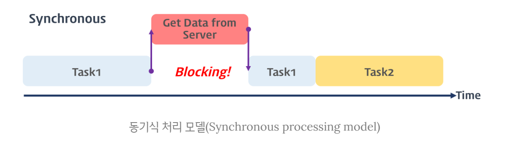
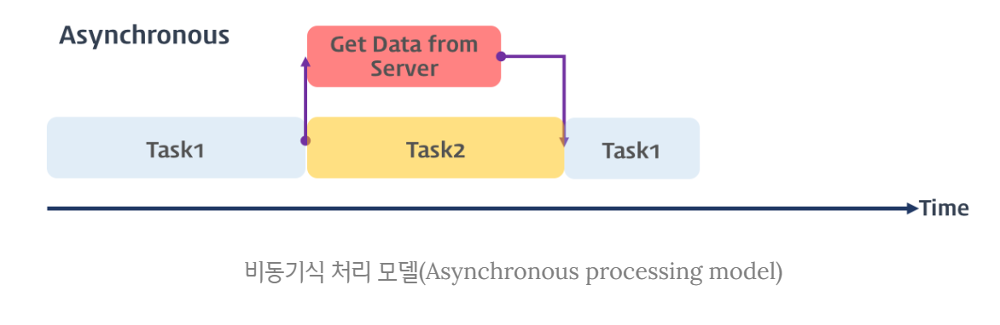
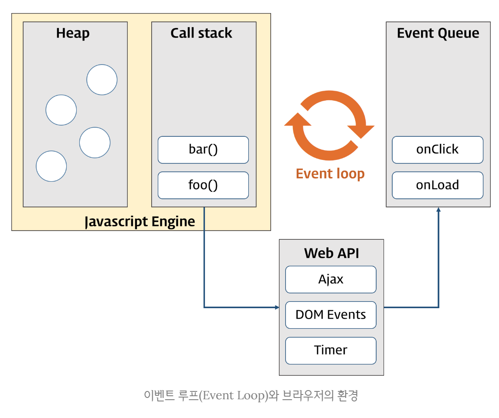

# 비동기 처리

## 비동기(Asynchronous)

웹 프론트엔드의 복잡성은 계속 증가하고 있습니다. 반면 JavaScript는 싱글 쓰레드 기반 이벤트 루프로 실행되기 때문에 동기 로직이 많아질수록 브라우저에서 앱의 사용성이 급격히 줄어들 겁니다. 따라서 현대의 JavaScript를 다루는 개발자라면 비동기와 동시성(concurrency), 나아가 병렬성(parallelism)에 대한 이해가 필수적입니다.

### 동기식 처리 모델 vs 비동기식 처리 모델

<https://poiemaweb.com/js-async>

#### 동기식 처리 모델

동기식 처리 모델(Synchronous processing model)은 직렬적으로 태스크(task)를 수행한다. 즉, 태스크는 순차적으로 실행되며 어떤 작업이 수행 중이면 다음 작업은 대기하게 된다.



```js
function func1() {
  console.log('func1');
  func2();
}

function func2() {
  console.log('func2');
  func3();
}

function func3() {
  console.log('func3');
}

func1();
```

#### 비동기식 처리 모델

비동기식 처리 모델(Asynchronous processing model 또는 Non-Blocking processing model)은 병렬적으로 태스크를 수행한다. 즉, 태스크가 종료되지 않은 상태라 하더라도 대기하지 않고 다음 태스크를 실행한다. 예를 들어 서버에서 데이터를 가져와서 화면에 표시하는 태스크를 수행할 때, 서버에 데이터를 요청한 이후 서버로부터 데이터가 응답될 때까지 대기하지 않고(Non-Blocking) 즉시 다음 태스크를 수행한다. 이후 서버로부터 데이터가 응답되면 이벤트가 발생하고 이벤트 핸들러가 데이터를 가지고 수행할 태스크를 계속해 수행한다.

자바스크립트의 대부분의 DOM 이벤트 핸들러와 Timer 함수(setTimeout, setInterval), Ajax 요청은 비동기식 처리 모델로 동작한다.



```js
function func1() {
  console.log('func1');
  func2();
}

function func2() {
  setTimeout(function() {
    console.log('func2');
  }, 0);

  func3();
}

function func3() {
  console.log('func3');
}

func1();
```

**setTimeout의 콜백함수는 즉시 실행되지 않고 지정 대기 시간만큼 기다리다가 “tick” 이벤트가 발생하면 태스크 큐로 이동한 후 Call Stack이 비어졌을 때 Call Stack으로 이동되어 실행된다.**

## 이벤트

<https://poiemaweb.com/js-event>
<https://developer.mozilla.org/en-US/docs/Web/Events>

### 이벤트 루프와 동시성

브라우저는 단일 쓰레드(single-thread)에서 이벤트 드리븐(event-driven) 방식으로 동작한다.

단일 쓰레드는 쓰레드가 하나뿐이라는 의미이며 이말은 곧 하나의 작업(task)만을 처리할 수 있다는 것을 의미한다. 하지만 실제로 동작하는 웹 애플리케이션은 많은 task가 동시에 처리되는 것처럼 느껴진다. 이처럼 자바스크립트의 동시성(Concurrency)을 지원하는 것이 바로 **이벤트 루프(Event Loop)**이다.

브라우저의 환경을 그림으로 표현하면 아래와 같다.



대부분의 자바스크립트 엔진은 크게 2개의 영역으로 나뉜다.

#### Call Stack(호출 스택)

작업이 요청되면(함수가 호출되면) 요청된 작업은 순차적으로 Call Stack에 쌓이게 되고 순차적으로 실행된다. 자바스크립트는 단 하나의 Call Stack을 사용하기 때문에 해당 task가 종료하기 전까지는 다른 어떤 task도 수행될 수 없다.

#### Heap

동적으로 생성된 객체 인스턴스가 할당되는 영역이다.

이와 같이 자바스크립트 엔진은 단순히 작업이 요청되면 Call Stack을 사용하여 요청된 작업을 순차적으로 실행할 뿐이다. 앞에서 언급한 동시성(Concurrency)을 지원하기 위해 필요한 비동기 요청(이벤트를 포함) 처리는 자바스크립트 엔진을 구동하는 환경 즉 브라우저(또는 Node.js)가 담당한다.

#### Event Queue(Task Queue)

비동기 처리 함수의 콜백 함수, 비동기식 이벤트 핸들러, Timer 함수(setTimeout(), setInterval())의 콜백 함수가 보관되는 영역으로 이벤트 루프(Event Loop)에 의해 특정 시점(Call Stack이 비어졌을 때)에 순차적으로 Call Stack으로 이동되어 실행된다.

#### Event Loop(이벤트 루프)

Call Stack 내에서 현재 실행중인 task가 있는지 그리고 Event Queue에 task가 있는지 반복하여 확인한다. 만약 Call Stack이 비어있다면 Event Queue 내의 task가 Call Stack으로 이동하고 실행된다.

## Promise

<https://developer.mozilla.org/ko/docs/Web/JavaScript/Reference/Global_Objects/Promise>
<https://joshua1988.github.io/web-development/javascript/promise-for-beginners/>

현재 JavaScript를 다루는 개발자라면 Promise에 대한 이해는 필수적입니다. 흔히 Promise에 대한 자료를 보면 callback hell을 해결해준다는 말이 많지만 이는 Promise의 진정한 가치는 아닙니다. 그러면 왜 사용할까요? callback의 호출 시점은 우리가 정할 수 없습니다. 반면 Promise는 원할 때 호출할 수 있습니다. then이 바로 그 시점이죠. 물론 resolve된 상태여야 합니다. 이번 강의에서는 Promise에 대해서 자세히 다루지 않고 깊은 이해가 없어도 진행엔 전혀 문제가 없습니다. 언젠가 비동기와 동시성에 제대로 공부하실 땐 아래 강의를 추천드립니다.

<https://youtube.com/playlist?list=PLBNdLLaRx_rImvbuZnfO-Ecv9OpuCNoCl>

## async/await

<https://ko.javascript.info/async-await>
<https://joshua1988.github.io/web-development/javascript/js-async-await/>

아무리 Promise가 callback보다 편하다지만 대부분의 사람은 비동기 코드를 이해하기 힘들고 작성하기도 쉽지 않습니다. 비동기 코드를 평소 익숙하게 작성하던 동기적 코드로 작성할 수 있다면 얼마나 편할까요? 그래서 나온 게 async/await 입니다. 처음 접하신 분들도 생각보다 쉽게 이해할 수 있으니 학습하실 것을 권해드립니다.

## fetch

<https://ko.javascript.info/fetch>

AJAX(Asynchronous JavaScript And XML)은 특정한 기술이 아닌 비동기적인 웹 애플리케이션 제작을 위한 기법을 나타냅니다. ES2015 이전엔 AJAX를 위해 사용하던 API인 XMLHttpReqeust가 브라우저에 내장되어 있었지만 ES2015부턴 Fetch API가 표준으로 등장하면서 이젠 fetch를 많이 사용합니다.

## REST

<https://meetup.toast.com/posts/92>
<https://www.youtube.com/watch?v=RP_f5dMoHFc>

REST API를 제대로 디자인하는 건 쉽지 않습니다. 하지만 웹 개발자라면 REST에 대해서 반드시 알고 있어야 합니다. 물론 위의 자료를 보고 지금은 모두 이해하려고 애쓰지 않아도 좋습니다. 자세히 몰라도 이 과정을 진행하는데 무리가 전혀 없습니다. 지금은 패스하셔도 됩니다. 하지만 언젠간 제대로 공부하셔야 합니다!

## Redux에서 비동기 액션 실행하기

우리가 지금까지 작성한 코드들은 모두 동기 로직이었습니다. 액션이 dispatch 될 때 마다 상태가 즉시 업데이트되었습니다.

만약에 우리가 비동기적인 로직을 실행하고 싶다면 어떻게 할 수 있을까요? 예를 들면 특정한 서버로부터 데이터를 요청 같은 행위들이 있겠죠.

### Redux Thunk middleware

`Redux Thunk middleware`는 Action creator가 액션을 반환하는 대신에 함수를 반환합니다. 그래서 특정 액션이 실행되는 것을 지연시키거나 특정한 조건이 충족될 때만 액션이 실행될 수 있도록 할 수 있습니다.

```js
const INCREMENT_COUNTER = 'INCREMENT_COUNTER';

function increment() {
  return {
    type: INCREMENT_COUNTER,
  };
}

function incrementAsync() {
  return (dispatch) => {
    setTimeout(() => {
      // Yay! Can invoke sync or async actions with `dispatch`
      dispatch(increment());
    }, 1000);
  };
}
```

두 번째 파라미터인 `getState`를 이용하여 현재 상태를 불러올 수 있습니다. 그리고 아무것도 `dispatch`하지 않는다면 아무일도 일어나지 않습니다.

```js
function incrementIfOdd() {
  return (dispatch, getState) => {
    const { counter } = getState();

    if (counter % 2 === 0) {
      return;
    }

    dispatch(increment());
  };
}
```

### Redux Thunk 설치하기

```bash
npm install redux-thunk
```

스토어를 만들 때 두 번째 인자로 미들웨어에 등록해야 합니다.

```js
import { createStore, applyMiddleware } from 'redux';

import thunk from 'redux-thunk';

import reducer from './reducer';

const store = createStore(reducer, applyMiddleware(thunk));
```

## 기타 링크

<https://redux.js.org/tutorials/fundamentals/part-6-async-logic>
<https://github.com/reduxjs/redux-thunk>
