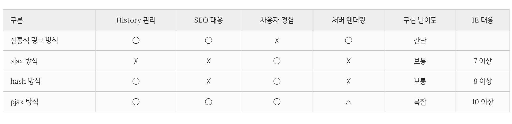

# 라우팅

## historyApiFallback

대다수의 웹 서비스를 보면 존재하지 않는 페이지에 접근할 때 index.html로 redirect 해주는 걸 볼 수 있습니다. 개발 환경에서 이러한 기능은 webpack devServer에서 설정할 수 있습니다.

<https://webpack.js.org/configuration/dev-server/#devserverhistoryapifallback>

```js
module.exports = {
  //...
  devServer: {
    historyApiFallback: {
      index: 'index.html',
    },
  },
};
```

## Window.location

<https://developer.mozilla.org/ko/docs/Web/API/Location>

`window.location`을 통해서 Location 객체를 얻어올 수 있습니다. Location에서 얻어올 수 있는 정보는 위의 링크를 참고하세요.

`window.location.pathname`

## Routing

라우팅이란 출발지에서 목적지까지의 경로를 결정하는 기능입니다. 애플리케이션의 라우팅은 사용자가 태스크를 수행하기 위해 어떤 화면(view)에서 다른 화면으로 화면을 전환하는 내비게이션을 관리하기 위한 기능을 의미합니다. 일반적으로 사용자가 요청한 URL 또는 이벤트를 해석하고 새로운 페이지로 전환하기 위한 데이터를 취득하기 위해 서버에 필요 데이터를 요청하고 화면을 전환하는 위한 일련의 행위를 말합니다. 자세한 사항은 위의 문서에서 학습하실 수 있습니다.

<https://poiemaweb.com/js-spa>

### 1. SPA

단일 페이지 애플리케이션(Single Page Application, SPA)는 모던 웹의 패러다임이다. SPA는 기본적으로 단일 페이지로 구성되며 기존의 서버 사이드 렌더링과 비교할 때, 배포가 간단하며 네이티브 앱과 유사한 사용자 경험을 제공할 수 있다는 장점이 있다.

SPA는 기본적으로 웹 애플리케이션에 필요한 모든 정적 리소스를 최초 접근시 단 한번만 다운로드한다. 이후 새로운 페이지 요청 시, 페이지 갱신에 필요한 데이터만을 JSON으로 전달받아 페이지를 갱신하므로 전체적인 트래픽을 감소시킬 수 있고, 전체 페이지를 다시 렌더링하지 않고 변경되는 부분만을 갱신하므로 새로고침이 발생하지 않아 네이티브 앱과 유사한 사용자 경험을 제공할 수 있다.

### 2. Routing

라우팅이란 출발지에서 목적지까지의 경로를 결정하는 기능이다. 애플리케이션의 라우팅은 사용자가 태스크를 수행하기 위해 어떤 화면(view)에서 다른 화면으로 화면을 전환하는 내비게이션을 관리하기 위한 기능을 의미한다. 일반적으로 라우팅은 사용자가 요청한 URL 또는 이벤트를 해석하고 새로운 페이지로 전환하기 위해 필요한 데이터를 서버에 요청하고 페이지를 전환하는 위한 일련의 행위를 말한다.

브라우저가 화면을 전환하는 경우는 다음과 같다.

1. 브라우저의 주소창에 URL을 입력하면 해당 페이지로 이동한다.
2. 웹페이지의 링크(a 태그)를 클릭하면 해당 페이지로 이동한다.
3. 브라우저의 뒤로가기 또는 앞으로가기 버튼을 클릭하면 사용자 방문 기록(history)의 뒤 또는 앞으로 이동한다. history 관리를 위해서는 각 페이지는 브라우저의 주소창에서 구별할 수 있는 유일한 URL을 소유해야 한다.

### 3. SPA와 Routing



#### 3.1. 전통적 링크 방식

전통적 링크 방식은 link tag로 동작하는 기본적인 웹페이지의 동작 방식이다.

이때 서버는 html로 화면을 표시하는데 부족함이 없는 완전한 리소스를 클라이언트에 응답한다. 이를 서버 사이드 렌더링(SSR)이라 한다. 브라우저는 서버가 응답한 html을 응답받아 렌더링한다. 이때 응답받은 html로 전체 페이지를 다시 렌더링하게 되므로 새로고침이 발생한다.

이 방식은 자바스크립트의 도움 없이 응답받은 html만으로 렌더링이 가능하며 각 페이지마다 고유의 URL이 존재하므로 history 관리 및 SEO 대응에 아무런 문제가 없다. 하지만 요청마다 중복된 리소스를 응답받아야 하며 전체 페이지를 다시 렌더링하는 과정에서 새로고침이 발생하여 사용성이 좋지 않은 단점이 있다.

#### 3.2. ajax 방식

ajax(Asynchronous JavaScript and XML)는 자바스크립트를 이용해서 비동기적(asynchronous)으로 서버와 브라우저가 데이터를 교환할 수 있는 통신 방식을 의미한다.

서버로부터 웹페이지가 응답되면 화면 전체를 새롭게 렌더링해야 하는데 페이지 일부만 갱신하고도 동일한 효과를 볼 수 있도록 하는 것이 ajax이다.

ajax 요청은 주소창의 URL을 변경시키지 않는다. 이는 브라우저의 뒤로가기, 앞으로가기 등의 history 관리가 동작하지 않음을 의미한다. 따라서 history.back(), history.go(n) 등도 동작하지 않는다. 주소창의 URL이 변경되지 않기 때문에 새로고침을 해도 언제나 첫페이지가 다시 로딩된다. 동일한 하나의 URL로 동작하는 ajax 방식은 SEO 이슈에서도 자유로울 수 없다.

#### 3.3 Hash 방식

ajax 방식은 불필요한 리소스 중복 요청을 방지할 수 있고 새로고침이 없는 사용자 경험을 구현할 수 있다는 장점이 있지만 history 관리가 되지 않는 단점이 있다. 이를 보완한 방법이 Hash 방식이다.

Hash 방식은 URI의 fragment identifier(#service)의 고유 기능인 앵커(anchor)를 사용한다. fragment identifier는 hash mark 또는 hash라고 부르기도 한다.

위 예제를 살펴보면 link tag(`<a href="#service">Service</a>` 등)의 href 어트리뷰트에 hash를 사용하고 있다. 즉, 내비게이션이 클릭되면 hash가 추가된 URI가 주소창에 표시된다. 단, URL이 동일한 상태에서 hash만 변경되면 브라우저는 서버에 어떠한 요청도 하지 않는다. 즉, URL의 hash는 변경되어도 서버에 새로운 요청을 보내지 않으며 따라서 페이지가 갱신되지 않는다. hash는 요청을 위한 것이 아니라 fragment identifier(#service)의 고유 기능인 앵커(anchor)로 웹페이지 내부에서 이동을 위한 것이기 때문이다.

또한 hash 방식은 서버에 새로운 요청을 보내지 않으며 따라서 페이지가 갱신되지 않지만 페이지마다 고유의 논리적 URL이 존재하므로 history 관리에 아무런 문제가 없다.

hash 방식의 단점은 url에 불필요한 #이 들어간다는 것이다. 일반적으로 hash 방식을 사용할 때 #!을 사용하기도 하는데 이를 **해시뱅(Hash-bang)**이라고 부른다.

hash 방식은 과도기적 기술이다. HTML5의 History API인 **pushState**가 모든 브라우저에서 지원이 된다면 해시뱅은 사용하지 않아도 되지만 현재 pushState는 일부의 브라우저(IE 10 이상)에서만 지원이 가능하다.

또 다른 문제는 **SEO 이슈**이다. 웹 크롤러는 검색 엔진이 웹사이트의 콘텐츠를 수집하기 위해 HTTP와 URL 스펙(RFC-2396같은)을 따른다. 이러한 크롤러는 JavaScript를 실행시키지 않기 때문에 hash 방식으로 만들어진 사이트의 콘텐츠를 수집할 수 없다. 구글은 해시뱅을 일반적인 URL로 변경시켜 이 문제를 해결한 것으로 알려져 있지만 다른 검색 엔진은 hash 방식으로 만들어진 사이트의 콘텐츠를 수집할 수 없을 수도 있다.

#### 3.4 pjax 방식

hash 방식의 가장 큰 단점은 SEO 이슈이다. 이를 보완한 방법이 HTML5의 History API인 pushState와 popstate 이벤트를 사용한 pjax(pushState + ajax) 방식이다. pushState와 popstate은 IE 10 이상에서 동작한다.

이때 ajax 요청은 브라우저 주소창의 URL을 변경시키지 않아 history 관리가 불가능하다. 이때 사용하는 것이 pushState 메서드이다. pushState 메서드는 주소창의 URL을 변경하고 URL을 history entry로 추가하지만 서버로 HTTP 요청을 하지는 않는다.

단, 브라우저의 새로고침 버튼을 클릭하면 브라우저 주소창의 url이 변경되지 않는 ajax 방식과 해시(fragment identifier)만 추가되는 hash 방식은 서버에 별도의 요청을 보내지 않지만 pjax 방식은 브라우저 주소창의 url이 변경되기 때문에 요청(예를 들어 localhost:5004/service)이 서버로 전달된다. 즉, **pjax 방식은 서버 렌더링 방식과 ajax 방식이 혼재되어 있는 방식으로 서버의 지원이 필요하다.**

## React Router

<https://v5.reactrouter.com/web/guides/quick-start>

### 설치

```bash
npm i react-router-dom
```
